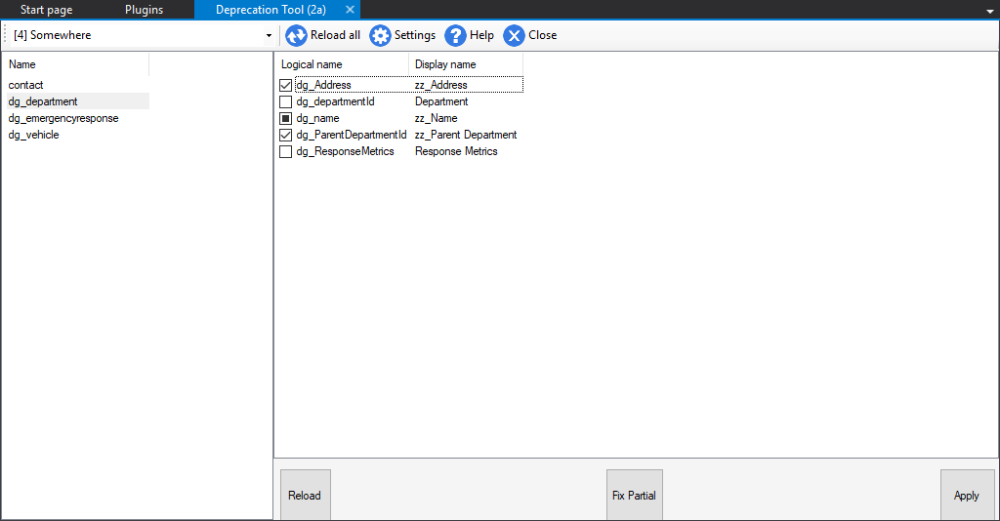
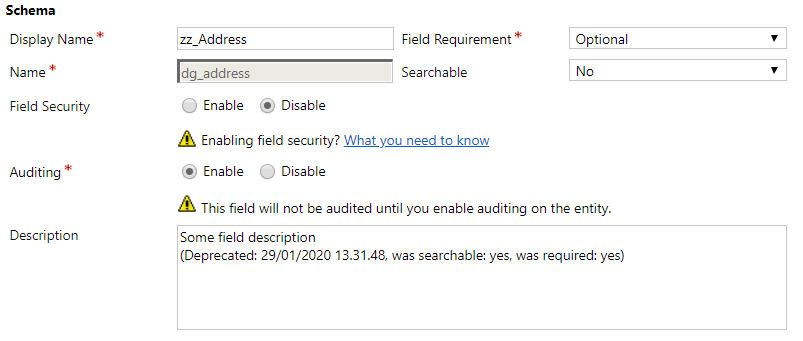
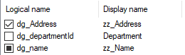
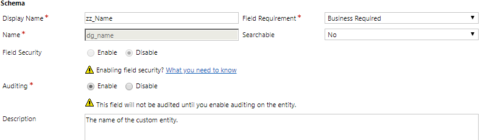
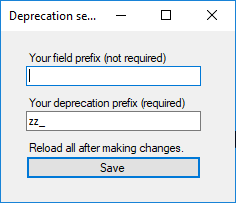

# Welcome to Delegate's xRM field Deprecation Tool.

This tool helps you mark fields as deprecated by
1. Prepending display name with a deprecation prefix, such as "zz_"
2. Marking field as not searchable (IsValidForAdvancedFind set to no)
3. Appending deprecation metadata at the end of the field's description,     e.g. "(Deprecated: 29/01/2020 13.31.48, was searchable: yes, was required: yes)"

Note, this tool is non-destructive.
We only add and remove relevant deprecation data, we do not actually delete any fields or their data! As long as settings are consistent when deprecating fields, every operation is reversible.

## Usage:
After you select an organization to connect to:
1. Choose solution from the top left combobox.
2. Choose entity from left list view
3. Decide deprecation state of fields.

Buttons *Reload*, *Fix partial* and *Apply* are enabled when an entity has been selected. The buttons Reset and Fix partial do not change anything in your organization, the Apply button acts upon the state of the field list check box states.
- Reload button reloads all fields for the selected entity, and resets to the check deprecation state they originally were.
- Fix partial goes though the selected entity field list and changes partially deprecated states to deprecated.
- Apply is the **only button that acts upon the changes** in the field list. It applys deprecated/partial/favored field states. It only updates fields that has a different state from the original, loaded state.

*Beware, that there's no active synchronization between the UI and your organization. If a field changes state while you're applying changes, errors might occour!* Reloading when field changes happen should get around this. 

The tool uses 3 states for checkboxes
- Checked, means deprecated
- Unchecked, means non-deprecated (or favored)
- Filled square, means partially deprecated
 

**Partially deprecated** simply specifies when a field only has a deprecation prefix (set in settings) in its display name, 
but lacks description metadata. A partially deprecated field could look like this:

Entities and fields are sorted alphabetically by logical name by default. Clicking the columns of the lists will change switch between ascending and descending alphabetical sorting.

## Settings
The tool has a couple settings that you can set from the cog wheel button:
- **Field prefix**: a filtering criterion for your fields. Only field with this prefix will be shown in the tool.
  default: empty
- **Deprecation prefix**: The prefix that will be prepended to deprecated fields. This is also used to judge if a field is deprecated/partially deprecated. 
  default: `zz_`
- Both these settings are case insensitive. Be sure to reload all after changing them.
 